# SQL Data Analytics Project with Power BI Visualization

## Brief Description about this Project
The goal of this project is to create a relational database and use custom SQL queries to perform Exploratory Data Analysis (EDA) to gain insights from the data. This project also demonstrates the ETL process by extracting data with custom SQL queries, transforming and loading it using Power Query, and creating new measures with DAX. The processed data is then presented in an interactive dashboard. Microsoft SQL is used for database creation and analysis, while Excel and Power BI serve as visualization tools (charts and dashboards).

## Data Preparation
#### Data Description
The dataset used in this project is the same one from my [previous project](https://github.com/mrnrasyad/Sales-Dashboard-using-Excel/edit/main/README.md), downloaded from [Kaggle](https://www.kaggle.com/datasets/zahidmughal2343/amazon-sales-2025). **Note that only the cleaned data is used**. All files for this project can be accessed in the assets folder. The variables are described below.

1. Date - Date of the order.
2. Product - Name of the product purchased.
3. Category - Product category (Electronics, Clothing, Home Appliances, etc.).
4. Price - Price of a single unit of the product.
5. Quantity - Number of units purchased in the order.
6. Total Sales - Total revenue from the order (Price × Quantity).
7. Customer Name - Name of the customer.
8. Customer Location - City where the customer is based.
9. Payment Method - Mode of payment (Credit Card, Debit Card, PayPal, etc.).
10. Status - Order status (Completed, Pending, or Cancelled).

#### Create Database and Relational Database
**Importing the database:**
- Create a database using `CREATE DATABASE`.
- Import the cleaned CSV file into the database.

**Creating the relational database:**
- Create tables using `CREATE TABLE`.
- Insert the data, then define primary and foreign keys using `ALTER TABLE`.

<details>
  <summary>Queries</summary>
  
  ```sql
-- create Customer table 
CREATE TABLE [Customer] (
    CustomerID INT IDENTITY(1,1),
    CustomerName VARCHAR(200) NOT NULL,
    CustomerLocation VARCHAR(200) NOT NULL,
    CONSTRAINT PK_Customer PRIMARY KEY CLUSTERED (CustomerID ASC)
)
-- insert Customer data
INSERT INTO Customer (CustomerName, CustomerLocation)
SELECT DISTINCT Customer_Name, Customer_Location
FROM sales_staging;

-- create OrderStatus table 
CREATE TABLE [OrderStatus] (
    -- Clustered
    [OrderStatusID] INT IDENTITY(1,1) ,
    [Name] varchar(100)  NOT NULL ,
    CONSTRAINT [PK_OrderStatus] PRIMARY KEY CLUSTERED (
        [OrderStatusID] ASC
    ),
    CONSTRAINT [UK_OrderStatus_Name] UNIQUE (
        [Name]
    )
)
-- insert OrderStatus data
INSERT INTO OrderStatus (Name)
SELECT DISTINCT [Status] FROM sales_staging;

-- create PaymentMethod table
CREATE TABLE [PaymentMethod] (
    -- Clustered
    [PaymentMethodID] INT IDENTITY(1,1) ,
    [Name] varchar(100)  NOT NULL ,
    CONSTRAINT [PK_PaymentMethod] PRIMARY KEY CLUSTERED (
        [PaymentMethodID] ASC
    ),
    CONSTRAINT [UK_PaymentMethod_Name] UNIQUE (
        [Name]
    )
)
-- insert PaymentMethod data
INSERT INTO PaymentMethod (Name)
SELECT DISTINCT Payment_Method FROM sales_staging;

-- create Product table
CREATE TABLE [Product] (
    -- Clustered
    [ProductID] INT IDENTITY(1,1),
    -- Field documentation comment 3
    [ProductName] varchar(200)  NOT NULL ,
    [Category] varchar(200)  NOT NULL ,
    [Price] money  NOT NULL ,
    CONSTRAINT [PK_Product] PRIMARY KEY CLUSTERED (
        [ProductID] ASC
    ),
    CONSTRAINT [UK_Product_ProductName] UNIQUE (
        [ProductName]
    )
)
-- insert Product data
INSERT INTO [Product] ([ProductName], [Category], [Price])
SELECT DISTINCT [Product], Category, Price
FROM sales_staging;

-- create OrderLine table 
CREATE TABLE [OrderLine] (
    [OrderLineID] INT IDENTITY(1,1) ,
    [OrderID] varchar(100)  NOT NULL ,
    [ProductID] int  NOT NULL ,
    [Quantity] int  NOT NULL ,
    [TotalAmount] money  NOT NULL ,
    CONSTRAINT [PK_OrderLine] PRIMARY KEY CLUSTERED (
        [OrderLineID] ASC
    )
)
-- insert OrderLine data
INSERT INTO [OrderLine] ([OrderID], [ProductID], [Quantity], [TotalAmount])
SELECT DISTINCT
    o.[OrderID],
    p.[ProductID],
    s.[Quantity],
    s.[Total_Amount]
FROM sales_staging s
JOIN [Product] p ON s.[Product] = p.ProductName
JOIN [Order] o ON s.Order_ID = o.[OrderID];

-- create Order table 
CREATE TABLE [Order] (
    -- Clustered
    [OrderID] varchar(100) NOT NULL ,
    [OrderDate] date  NOT NULL ,
    [CustomerID] int  NOT NULL ,
    [PaymentMethodID] int  NOT NULL ,
    [OrderStatusID] int  NOT NULL ,
    CONSTRAINT [PK_Order] PRIMARY KEY CLUSTERED (
        [OrderID] ASC
    )
)
-- ForeignKey using Alter Table
ALTER TABLE [Order] WITH CHECK ADD CONSTRAINT [FK_Order_CustomerID] FOREIGN KEY([CustomerID])
REFERENCES [Customer] ([CustomerID])
ALTER TABLE [Order] CHECK CONSTRAINT [FK_Order_CustomerID]

ALTER TABLE [Order] WITH CHECK ADD CONSTRAINT [FK_Order_PaymentMethodID] FOREIGN KEY([PaymentMethodID])
REFERENCES [PaymentMethod] ([PaymentMethodID])
ALTER TABLE [Order] CHECK CONSTRAINT [FK_Order_PaymentMethodID]

ALTER TABLE [Order] WITH CHECK ADD CONSTRAINT [FK_Order_OrderStatusID] FOREIGN KEY([OrderStatusID])
REFERENCES [OrderStatus] ([OrderStatusID])
ALTER TABLE [Order] CHECK CONSTRAINT [FK_Order_OrderStatusID]
-- insert Order data
INSERT INTO [Order] (OrderID, OrderDate, CustomerID, PaymentMethodID, OrderStatusID)
SELECT DISTINCT
    s.Order_ID,
    s.[Date],
    c.CustomerID,
    p.PaymentMethodID,
    o.OrderStatusID
FROM sales_staging s
JOIN Customer c ON s.Customer_Name = c.CustomerName AND s.Customer_Location = c.CustomerLocation
JOIN PaymentMethod p ON s.Payment_Method = p.[Name]
JOIN OrderStatus o ON s.[Status] = o.[Name];
  ```
</details>

Relational database design (Using [QuickDBD](https://www.quickdatabasediagrams.com/)): 
<p align="center">
  <kbd>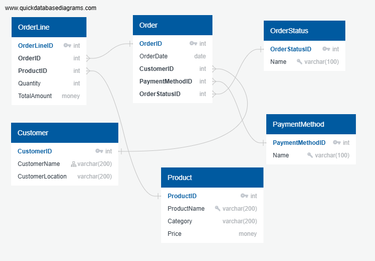 </kbd> <br>
  Relational Database Design
</p>


## Exploratory Data Analysis (EDA) using Custom SQL Queries
<details>
  <summary>Queries</summary>
  
  ```sql
--total orders by payment method
SELECT 
    pm.Name,
    COUNT(o.OrderID) AS Total
FROM [Order] o
JOIN PaymentMethod pm ON o.PaymentMethodID = pm.PaymentMethodID
GROUP BY pm.Name
ORDER BY Total DESC;

--total sales by cities
SELECT 
    c.CustomerLocation AS City,
    SUM(ol.TotalAmount) AS TotalSales
FROM OrderLine ol
JOIN [Order] o 
    ON ol.OrderID = o.OrderID
JOIN Customer c 
    ON o.CustomerID = c.CustomerID
GROUP BY c.CustomerLocation
ORDER BY TotalSales DESC;   

--total sales per category
SELECT 
    p.Category AS Category,
    SUM(ol.TotalAmount) AS TotalSales
FROM OrderLine ol
JOIN Product p 
    ON ol.ProductID = p.ProductID
GROUP BY p.Category
ORDER BY TotalSales DESC;   

--total sales per month
SELECT  
    FORMAT(o.OrderDate, 'MM') AS Month,
    SUM(ol.TotalAmount) AS Revenue
FROM OrderLine ol
JOIN [Order] o 
    ON ol.OrderID = o.OrderID
GROUP BY FORMAT(o.OrderDate, 'MM')
ORDER BY Month;

--total selling products
SELECT 
    p.ProductName AS ProductName,
    SUM(ol.TotalAmount) AS TotalSales
FROM OrderLine ol
JOIN Product p 
    ON ol.ProductID = p.ProductID
GROUP BY p.ProductName
ORDER BY TotalSales DESC;   

--total orders by status
SELECT 
    os.Name,
    COUNT(o.OrderID) AS Total
FROM [Order] o
JOIN OrderStatus os ON o.OrderStatusID = os.OrderStatusID
GROUP BY os.Name
ORDER BY Total DESC;
  ```
</details>

#### **Orders** by **Payment Method** Analysis
PayPal is the most used payment method (60 orders), followed by credit card (54) and debit card (53). Gift card (42) and Amazon Pay (41) trail behind, showing customers prefer traditional digital payments over alternative options.
<p align="center">
SQL Output: Orders by Payment Method<br>
  <kbd>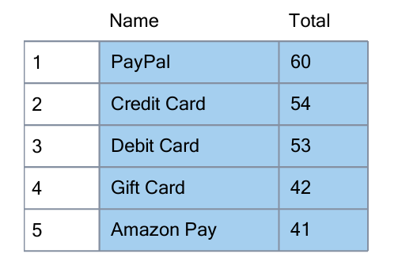 </kbd> <br>
</p>

<br>
<p align="center">
  <kbd>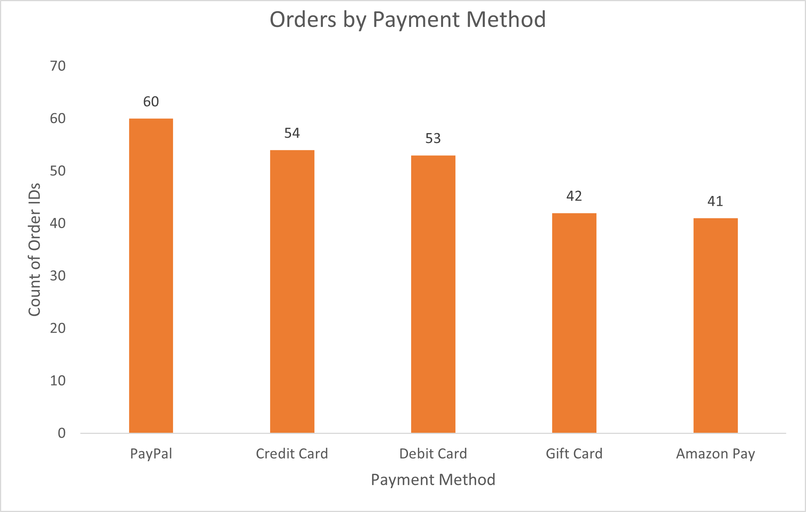 </kbd> <br>
 Chart: Orders by Payment Method
</p>

**Recommendation:** Maintain strong support for PayPal and card payments, as they dominate customer preference. At the same time, consider promotions or incentives (e.g., discounts, cashback) for Gift Card and Amazon Pay to encourage broader adoption and diversify payment usage.

#### **Orders** by **Status** Analysis
Out of the total orders, 88 were completed, 85 are still pending, and 77 were cancelled. While completed orders slightly lead, the high number of pending and cancelled orders indicates potential issues in order processing or customer experience.
<p align="center">
SQL Output: Orders by Status<br>
  <kbd>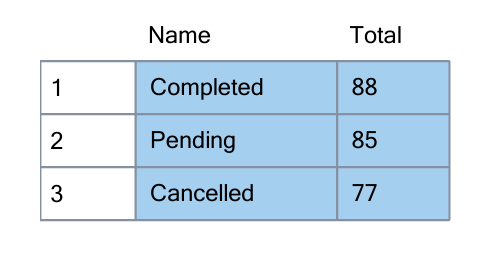 </kbd> <br>
</p>

<br>
<p align="center">
  <kbd>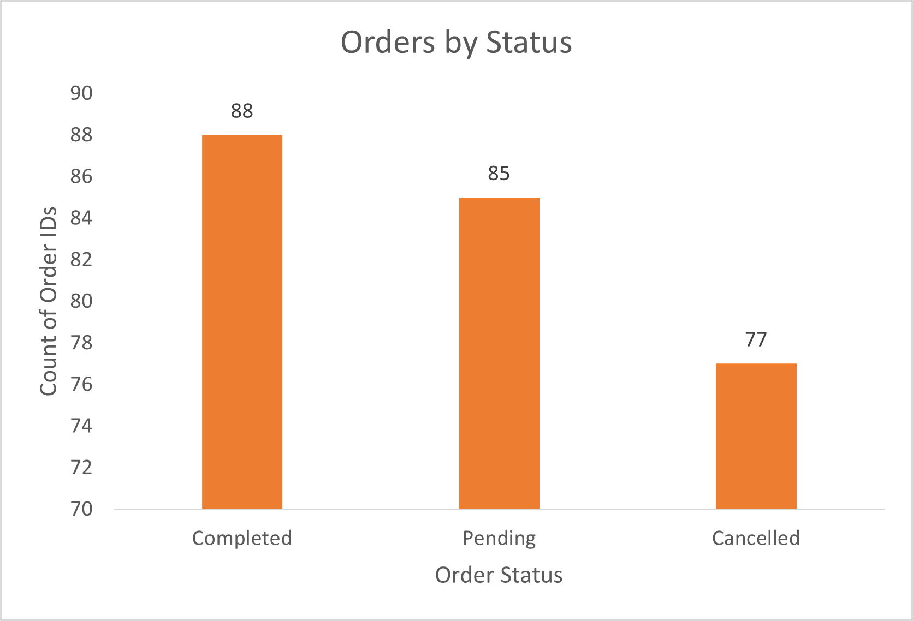 </kbd> <br>
 Chart: Orders by Status
</p>

**Recommendation:** Focus on reducing pending orders by streamlining order fulfillment and improving communication with customers. Investigate cancellation reasons—such as payment failures, stock issues, or customer dissatisfaction—and address them with better inventory management, clearer checkout processes, or improved customer support.

#### **Sales** by **City** Analysis
Miami leads with the highest sales (31,700), followed by Denver (29,785) and Houston (28,390). Meanwhile, San Francisco (16,195) and Los Angeles (17,820) record the lowest sales. This indicates significant differences in city-level performance, with some markets outperforming others.
<p align="center">
SQL Output: Sales by City<br>
  <kbd>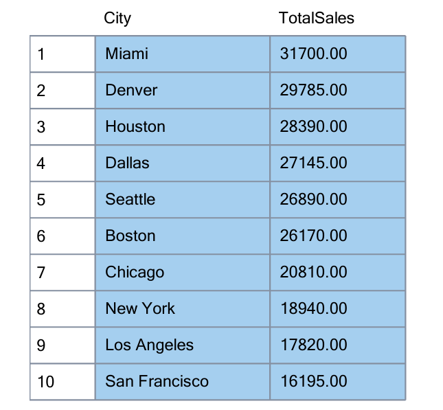 </kbd> <br>
</p>

<br>
<p align="center">
  <kbd>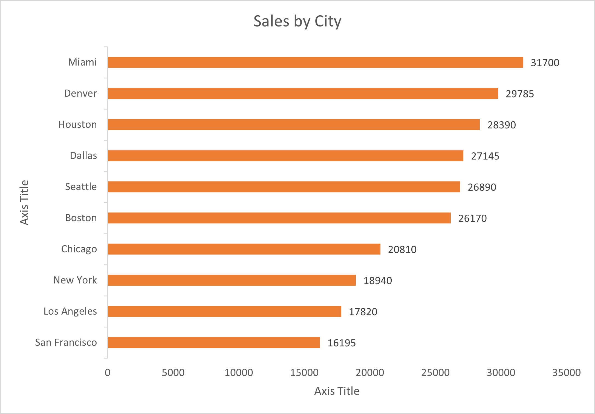 </kbd> <br>
 Chart: Sales by City
</p>

**Recommendation:** Focus on strong-performing cities like Miami and Denver with continued investment in marketing and customer engagement. For lower-performing cities such as San Francisco and Los Angeles, investigate demand gaps—consider localized promotions, partnerships, or customer experience improvements to boost sales.

#### **Sales** by **Product Category**
Electronics (129,950) and Home Appliances (105,000) dominate sales, far outperforming other categories. In contrast, Footwear (4,320), Clothing (3,540), and Books (1,035) contribute minimally, showing a highly uneven distribution of revenue across categories.
<p align="center">
SQL Output: Sales by Product Category<br>
  <kbd>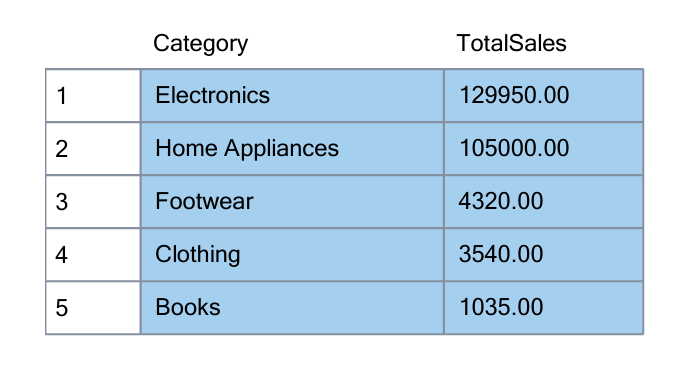 </kbd> <br>
</p>

<br>
<p align="center">
  <kbd>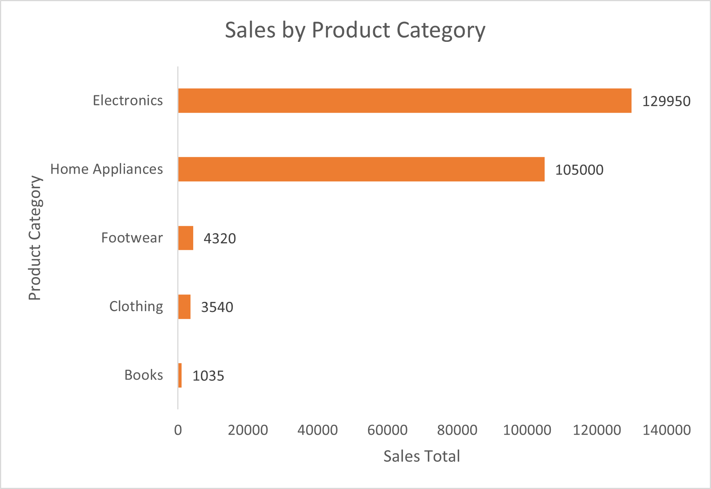 </kbd> <br>
 Chart: Sales by Product Category
</p>

**Recommendation:** Sustain investment in Electronics and Home Appliances, as they are the main revenue drivers. For low-performing categories, consider whether to improve visibility (through targeted promotions, bundling, or discounts) or reduce focus if they are not strategically important. Diversification could also help reduce over-reliance on top categories.

#### **Revenue** per **Month**
Revenue was strong in February (122,695) and March (117,730) but dropped sharply in April (3,420), indicating a sudden decline in sales activity.
<p align="center">
SQL Output: Revenue per Month<br>
  <kbd> </kbd> <br>
</p>

<br>
<p align="center">
  <kbd>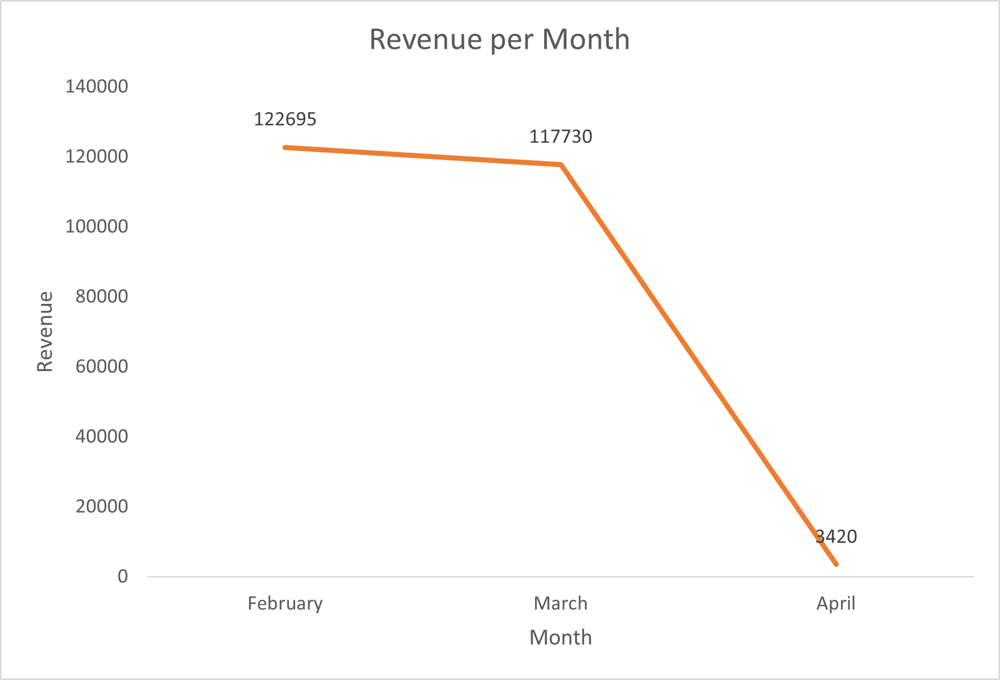 </kbd> <br>
 Chart: Revenue per Month
</p>

**Recommendation:** Investigate April’s drop — check for seasonality, data issues, or operational challenges. If seasonal, prepare targeted promotions for low months. If operational, address bottlenecks (e.g., inventory shortages or payment issues) to stabilize monthly revenue.

#### Top Selling Products
Refrigerators (78,000), laptops (58,400), and smartphones (48,500) dominate sales, while items like books (1,035) and T-shirts (1,060) contribute minimally. The product mix shows a heavy reliance on high-value electronics and appliances.
<p align="center">
SQL Output: Top Selling Products<br>
  <kbd>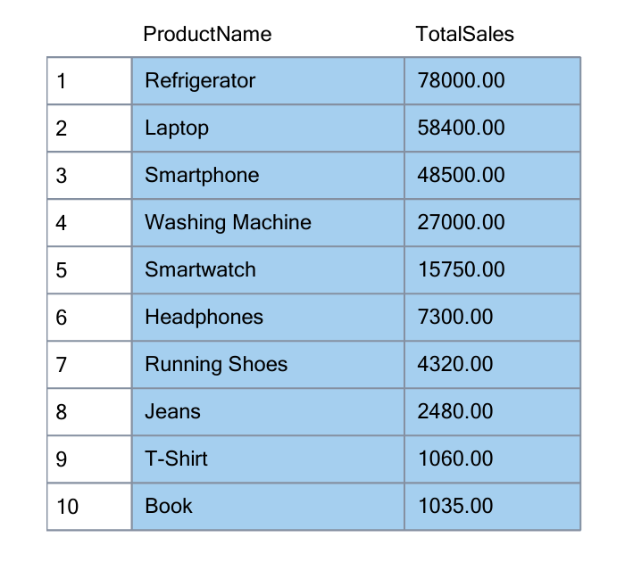 </kbd> <br>
</p>

<br>
<p align="center">
  <kbd>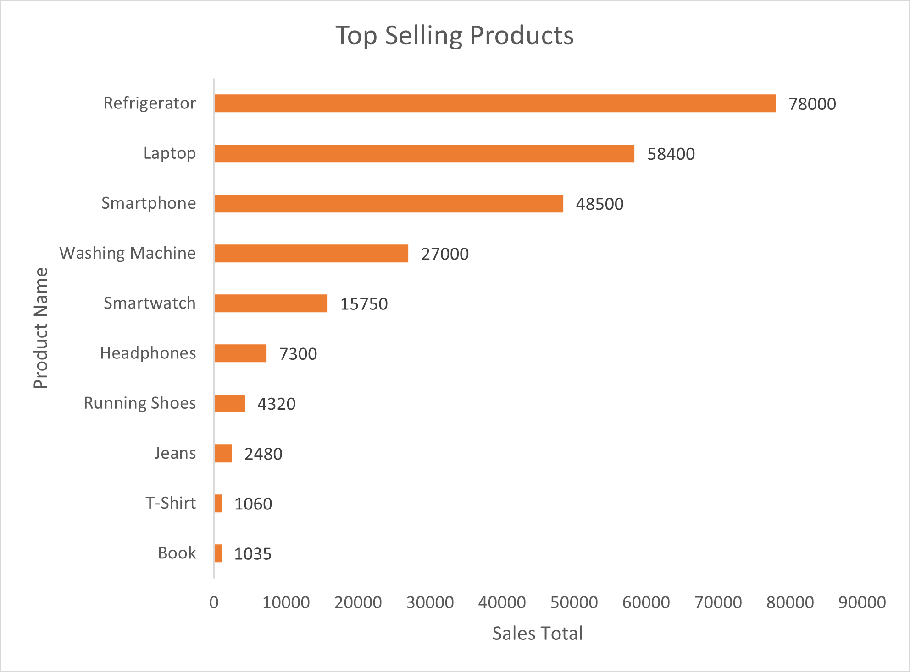 </kbd> <br>
 Chart: Top Selling Products
</p>

**Recommendation:** Maintain focus on high-performing electronics and appliances through promotions and inventory prioritization. For low-selling items, evaluate whether to reduce stock, bundle with popular products, or run targeted campaigns to boost demand.

## Dashboard Creation using Power BI
#### Extract Data from Database using Custom Queries
- Connect to MS SQL Database.
- Write custom SQL queries to select the required columns and join multiple tables using `JOIN`.
<details>
  <summary>Queries</summary>
  
  ```sql
SELECT
    o.OrderID,
    o.OrderDate,
    c.CustomerName,
    c.CustomerLocation,
    p.ProductName,
    p.Category,
    p.Price,
    ol.Quantity,
    ol.TotalAmount,
    pm.Name AS PaymentMethod,
    os.Name AS OrderStatus
FROM [Order] o
JOIN Customer c 
    ON o.CustomerID = c.CustomerID
JOIN PaymentMethod pm 
    ON o.PaymentMethodID = pm.PaymentMethodID
JOIN OrderStatus os 
    ON o.OrderStatusID = os.OrderStatusID
JOIN OrderLine ol 
    ON o.OrderID = ol.OrderID
JOIN Product p 
    ON ol.ProductID = p.ProductID;
  ```
</details>

#### Transform and Load with Power Query in Power BI
- Use Power Query to apply transformations:
  - Data type corrections (dates, numbers, text).
  - Standardize formats (e.g., YYYY-MM-DD for dates).
  - Rename column names.
- Load the transformed data into the PowerBI data model.

#### Visualize Data with Power BI
- Create measures DAX (Data Analysis Expressions) in PowerBI:
  - Create a new measure for **Total Order Count**.
  - Create a new measure for **Completed Revenue** (Revenue from orders with completed status).
- Design visuals:
  - Add separate cards for **Order Count**, **Total Revenue**, and **Completed Revenue**.
  - Use line charts to show total revenue trends per month.
  - Use bar charts for **Payment Method** and **Order Status** trends, as well as **Top Products** and **Top Customer Locations**.
  - Add filters for **Order Status**, **Payment Method**, and **Product Category**. 

<p align="center">
  <kbd>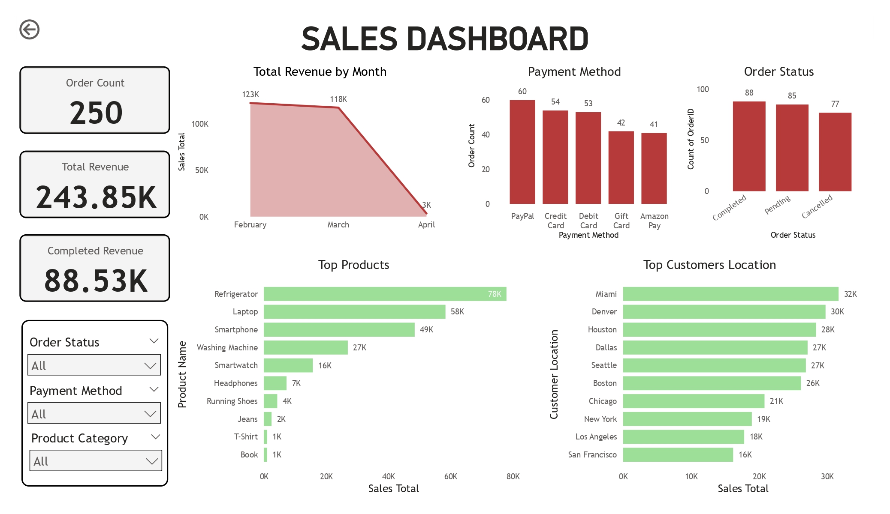 </kbd> <br>
 Power BI Sales Dashboard
</p>

## Summary
- PayPal is the most used payment method, while Gift Card and Amazon Pay are least used.
- Completed orders lead, but pending and cancelled orders are still high.
- Miami, Denver, and Houston are the top-performing cities.
- Electronics and Home Appliances dominate sales categories.
- Revenue was strong in Feb–Mar but dropped sharply in April.
- Refrigerators, laptops, and smartphones are the best-selling products.
