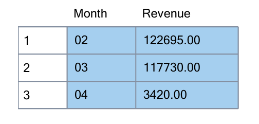

## Exploratory Data Analysis (EDA) using Custom SQL Queries
<details>
  <summary>Queries</summary>
  
  ```sql
--total orders by payment method
SELECT 
    pm.Name,
    COUNT(o.OrderID) AS Total
FROM [Order] o
JOIN PaymentMethod pm ON o.PaymentMethodID = pm.PaymentMethodID
GROUP BY pm.Name
ORDER BY Total DESC;

--total sales by cities
SELECT 
    c.CustomerLocation AS City,
    SUM(ol.TotalAmount) AS TotalSales
FROM OrderLine ol
JOIN [Order] o 
    ON ol.OrderID = o.OrderID
JOIN Customer c 
    ON o.CustomerID = c.CustomerID
GROUP BY c.CustomerLocation
ORDER BY TotalSales DESC;   

--total sales per category
SELECT 
    p.Category AS Category,
    SUM(ol.TotalAmount) AS TotalSales
FROM OrderLine ol
JOIN Product p 
    ON ol.ProductID = p.ProductID
GROUP BY p.Category
ORDER BY TotalSales DESC;   

--total sales per month
SELECT  
    FORMAT(o.OrderDate, 'MM') AS Month,
    SUM(ol.TotalAmount) AS Revenue
FROM OrderLine ol
JOIN [Order] o 
    ON ol.OrderID = o.OrderID
GROUP BY FORMAT(o.OrderDate, 'MM')
ORDER BY Month;

--total selling products
SELECT 
    p.ProductName AS ProductName,
    SUM(ol.TotalAmount) AS TotalSales
FROM OrderLine ol
JOIN Product p 
    ON ol.ProductID = p.ProductID
GROUP BY p.ProductName
ORDER BY TotalSales DESC;   

--total orders by status
SELECT 
    os.Name,
    COUNT(o.OrderID) AS Total
FROM [Order] o
JOIN OrderStatus os ON o.OrderStatusID = os.OrderStatusID
GROUP BY os.Name
ORDER BY Total DESC;
  ```
</details>

Results
#### **Orders** by **Payment Method**
<p align="center">
SQL Output: Orders by Payment Method<br>
  <kbd> </kbd> <br>
</p>

<br>
<p align="center">
  <kbd> </kbd> <br>
 Chart: Orders by Payment Method
</p>

#### **Orders** by **Status**
<p align="center">
SQL Output: Orders by Status<br>
  <kbd> </kbd> <br>
</p>

<br>
<p align="center">
  <kbd> </kbd> <br>
 Chart: Orders by Status
</p>


#### **Sales** by **City**
<p align="center">
SQL Output: Sales by City<br>
  <kbd> </kbd> <br>
</p>

<br>
<p align="center">
  <kbd> </kbd> <br>
 Chart: Sales by City
</p>

#### **Sales** by **Product Category**
<p align="center">
SQL Output: Sales by Product Category<br>
  <kbd> </kbd> <br>
</p>

<br>
<p align="center">
  <kbd> </kbd> <br>
 Chart: Sales by Product Category
</p>

#### **Revenue** per **Month**
<p align="center">
SQL Output: Revenue per Month<br>
  <kbd> </kbd> <br>
</p>

<br>
<p align="center">
  <kbd> </kbd> <br>
 Chart:  =Revenue per Month
</p>

#### Top Selling Products
<p align="center">
SQL Output: Top Selling Products<br>
  <kbd> </kbd> <br>
</p>

<br>
<p align="center">
  <kbd> </kbd> <br>
 Chart: Top Selling Products
</p>
